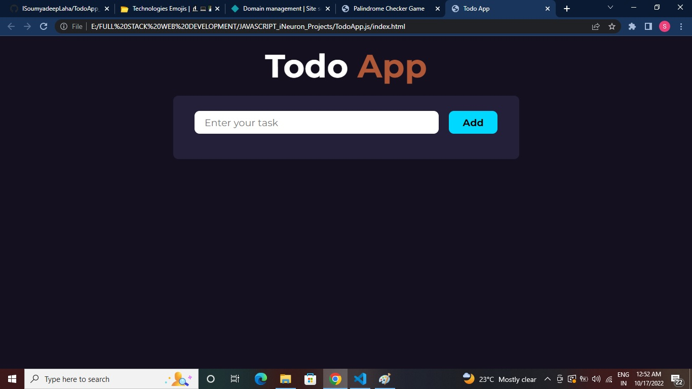
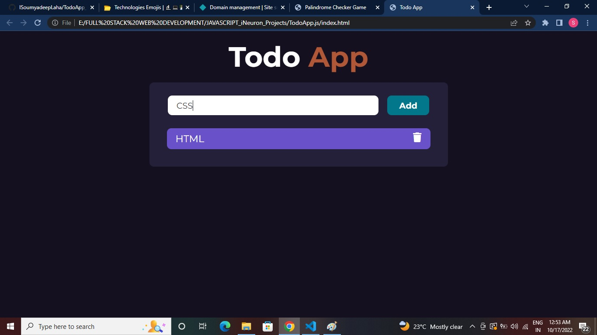
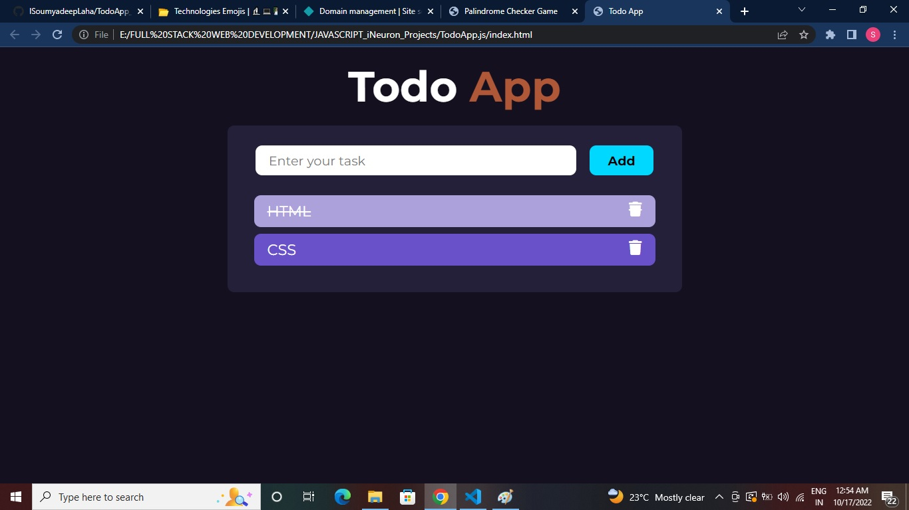
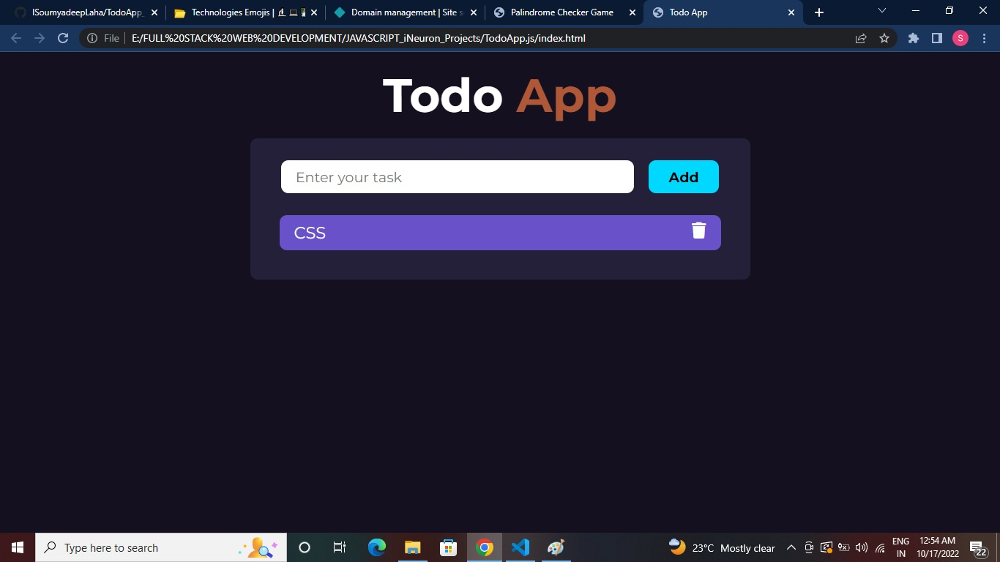

# 👩‍💻 Todo App using Javascript

By Soumyadeep Laha

# 🛠️ Technologies Used

- HTML5
- CSS3
- JavaScript

# 🚀 Time to complete

It tooked me around 4hrs to compelete the project

# 📷 Screen Shorts

# ✈️ Live Link

[Netlify Live...](https://soumyadeeplaha-todoappjs.netlify.app/)

